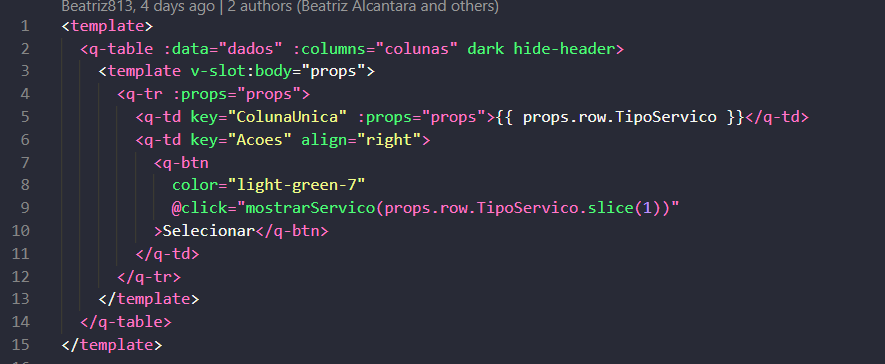
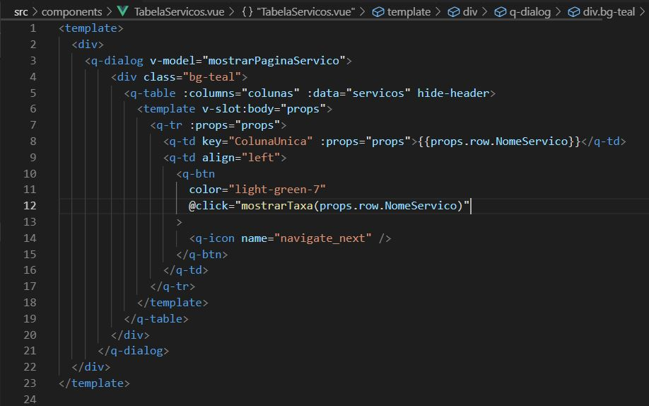
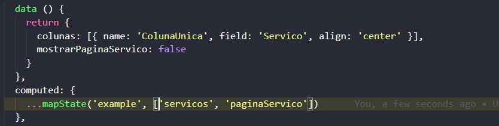
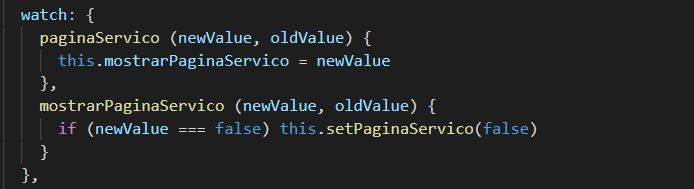
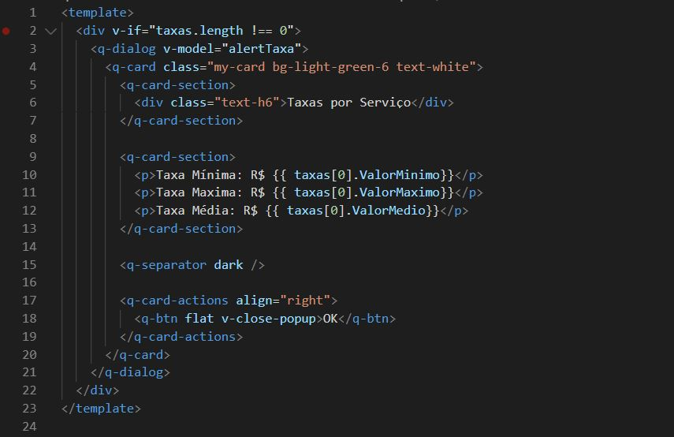
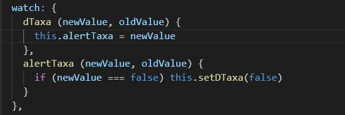
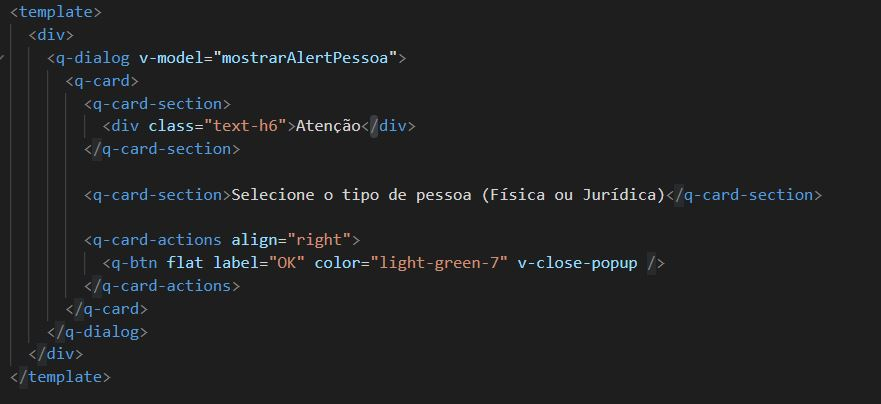
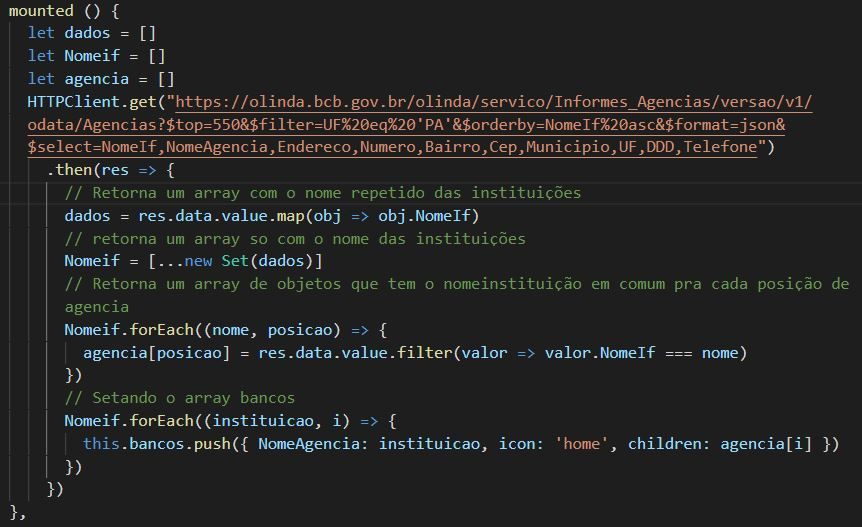

# Bank services and agencies guide

Simple aplication with Quasar and Bacen's API.

## Technologies
- [Quasar Framework](https://quasar.dev)
- [Bacen's API](https://dadosabertos.bcb.gov.br/dataset?res_format=API)
- [Axios](https://github.com/axios/axios)
- [Vuex](https://vuex.vuejs.org/)

## About Bacen's API
This API offers informations about brazilians banks and economical data about country

## Installing what you will need

### Install dependencies

If you download this project and want run locally you'll need this command:

```bash
npm install
```

### Starting a new project

But if you wish start a new project you should execute the following command:
```bash
quasar create project-name
```
Attention: to execute the command above you have to install quasar/cli previously. You could read [quasar documentation](https://quasar.dev/quasar-cli/installation) to install it.

When you run the command 'quasar create project-name', quasar/cli will ask you some questions. You have to pay attention to the following question:

```bash
Check the features needed to your project:
```
Then to this project you should mark to install ESLint, Axios and Vuex.

### Start the app in development mode
```bash
quasar dev
```

### Build the app for production
```bash
quasar build
```

## Explaining project

This project is divided in six components and two pages.

#### Index page
This image shows which components are used on index page.


Next image presents variables used in q-select component and the method executed to change model value (variable that keeps globally person type 'Física' or 'Jurídica')


### Components used on index page

#### Type of Service Table

in this image shows assignment of "dados" to property data that will fill the content table, and the assignment of "colunas" to property columns that will define the columns table.



One good point to say about this piece of code is that the method "mostrarServico()" makes a request to the API and receives a parameter in which serves as a filter. The parameter passed to method is the service name without first letter, it is done because the API has a filter that search data in which contains certain piece of word. Then if you put as filter the word "inanceiro" the API certainly will return to you data containing "Financeiro" or "financeiro", but if you use as filter the word "financeiro" the API will return to you just data containing "financeiro", the others with capital letter will be ignored in the search.

#### Service Table

This image shows the template of service table. The main structure is a dialog component that depends on a variable called "mostrarPaginServicos" to appear. The method "mostrarTaxa" is an action and it is responsable for request the services rates.



The variable "servicos" is a vuex state and it is setted by the method "mostrarServico()" called on Type of Service Table (tabelaTipoServico.vue) component.

To clarify what I'm saying see this image



The State "paginaServico" is the flag that controls when 'q-dialog' component has to be shown, but if we use it directly in 'v-model' of 'q-dialog' component we also have to declare a function setter to this variable. You can read about that [here.](https://br.vuejs.org/v2/guide/computed.html#Atribuicao-em-Dados-Computados)

However we could do the same functionality using Vue watch layer, like this:



This piece of code says that everytime the state "paginaServico" changed the variable "mostrarPaginaServico" receives the same value, and when "mostrarServico" changed the same logic repeats in reverse way.

### Service Rates

This dialog component will show the rates of each service.



The variable "taxas" is a vuex state.
The state "taxas" has values of minimum, maximum and average value.
"alertTaxa" is a local variable.

"alertTaxa" is setted in:



Every time that "dTaxa" changes "alertTaxa" will receive the same value, and every time that "alertTaxa" changes this process repeats in reverse way.

### Alert Kind of Person

This component was created to appear always that a service type is requested without a specific person defined.



The same logic used in the others dialogs components is kept to this component.

### Tree component

This component is used to show all banks and agencies of a state.

The data is obtained by the method called in mounted.


And saved in the local variable "bancos".


This local variable is passed to "q-tree" component to fill the tree content.

### Customize the configuration
See [Configuring quasar.conf.js](https://quasar.dev/quasar-cli/quasar-conf-js).
