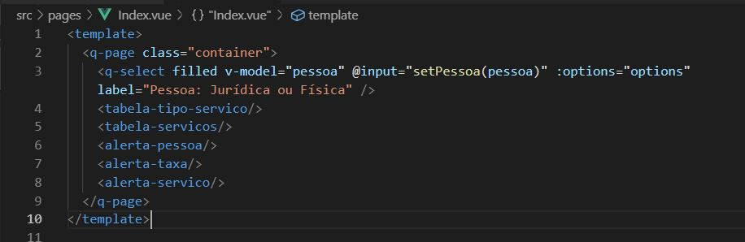
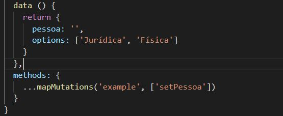

# Bank services and agencies guide

Simple aplication with Quasar and Bacen's API.

## Technologies
- [Quasar Framework](https://quasar.dev)
- [Bacen's API](https://dadosabertos.bcb.gov.br/dataset?res_format=API)
- [Axios](https://github.com/axios/axios)
- [Vuex](https://vuex.vuejs.org/)

## About Bacen's API
This API offers informations about brazilians banks and economical data about country

## Installing what you will need

### Install dependencies

If you download this project and want run locally you'll need this command:

```bash
npm install
```

### Starting a new project

But if you wish start a new project you should execute the following command:
```bash
quasar create project-name
```
Attention: to execute the command above you have to install quasar/cli previously. You could read [quasar documentation](https://quasar.dev/quasar-cli/installation) to install it.

When you run the command 'quasar create project-name', quasar/cli will ask you some questions. You have to pay attention to the following question:

```bash
Check the features needed for your project:
```
Then to this project you should mark to install ESLint, Axios and Vuex.

### Start the app in development mode
```bash
quasar dev
```

### Build the app for production
```bash
quasar build
```

## Explaining project

This project is divided in six components and two pages.

#### Index page
This image shows which components are used on index page.



Next image presents variables used in q-select component and the method executed to change model value (variable that keeps globally type person 'Física' or 'Jurídica')



### Components used on index page

#### Type of Service Table


### Customize the configuration
See [Configuring quasar.conf.js](https://quasar.dev/quasar-cli/quasar-conf-js).
